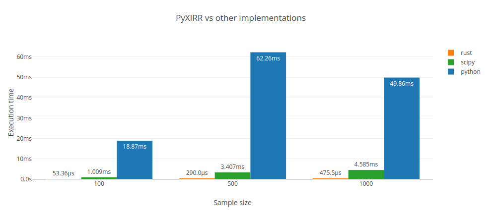

[](https://www.rust-lang.org/)
[](https://github.com/Anexen/pyxirr/blob/master/LICENSE)
[](https://pypi.org/project/pyxirr/)
[](https://pypi.org/project/pyxirr/)

# PyXIRR

Rust-powered collection of financial functions.

Features:

- correct
- blazingly fast
- works with iterators
- works with unordered input
- no external dependencies

# Installation

```
pip install pyxirr
```

# Benchmarks

Rust implementation has been tested against existing [xirr](https://pypi.org/project/xirr/) package
(uses [scipy.optimize](https://docs.scipy.org/doc/scipy/reference/generated/scipy.optimize.newton.html) under the hood)
and the [implementation from the Stack Overflow](https://stackoverflow.com/a/11503492) (pure python).



PyXIRR is ~10-20x faster than other solutions!

Powered by [github-action-benchmark](https://github.com/rhysd/github-action-benchmark).

Live benchmarks are hosted on [Github Pages](https://anexen.github.io/pyxirr/dev/bench).

# Examples

```python
from datetime import date
from pyxirr import xirr

dates = [date(2020, 1, 1), date(2021, 1, 1), date(2022, 1, 1)]
amounts = [-1000, 1000, 1000]

# feed columnar data
xirr(dates, amounts)
# feed iterators
xirr(iter(dates), (x for x in amounts))
# feed an iterable of tuples
xirr(zip(dates, amounts))
# feed a dictionary
xirr(dict(zip(dates, amounts)))
```

Numpy and Pandas support

```python
import numpy as np
import pandas as pd

# feed numpy array
xirr(np.array([dates, amounts]))
xirr(np.array(dates), np.array(amounts))
# feed DataFrame (columns names doesn't matter; ordering matters)
xirr(pd.DataFrame({"a": dates, "b": amounts}))
```

# API reference

Let's define type annotations:

```python
# `None` if the calculation fails to converge or result is NAN.
# could return `inf` or `-inf`
FloatOrNone = Optional[float]

DateLike = Union[datetime.date, datetime.datetime, numpy.datetime64, pandas.Timestamp]
Rate = float  # rate as decimal, not percentage, normally between [-1, 1]
Guess = Optional[Rate]
Amount = Union[int, float, Decimal]
Payment = Tuple[DateLike, Amount]

DateLikeArray = Iterable[DateLike]
AmountArray = Iterable[Amount]
CashFlowTable = Iterable[Payment]
CashFlowDict = Dict[DateLike, Amount]
```

## Exceptions

- `InvalidPaymentsError`. Occurs if either:
  - the amounts and dates arrays (`AmountArray`, `DateLikeArray`) are of different lengths
  - the given arrays do not contain at least one negative and at least one positive value

## XIRR

```python
# raises: InvalidPaymentsError
def xirr(
    dates: Union[CashFlowTable, CashFlowDict, DateLikeArray],
    amounts: Optional[AmountArray] = None,
    guess: Guess = None,
) -> FloatOrNone
```

## XNPV

```python
# raises: InvalidPaymentsError
def xnpv(
    rate: Rate,
    dates: Union[CashFlowTable, CashFlowDict, DateLikeArray],
    amounts: Optional[AmountArray] = None,
) -> FloatOrNone
```

## IRR

Compute the Internal Rate of Return (IRR)

```python
# raises: InvalidPaymentsError
def irr(amounts: AmountArray, guess: Guess = None) -> FloatOrNone
```

## NPV

Compute the Net Present Value.

```python
# raises: InvalidPaymentsError
def npv(rate: Rate, amounts: AmountArray) -> FloatOrNone
```

## FV

Compute the future value.

```python
def fv(
    rate: Rate, # Rate of interest per period
    nper: int, # Number of compounding periods
    pmt: Amount, # Payment
    pv: Amount, # Present value
    pmt_at_begining: bool = False  # When payments are due
) -> FloatOrNone
```

## PV

Compute the present value.

```python
def pv(
    rate: Rate, # Rate of interest per period
    nper: int, # Number of compounding periods
    pmt: Amount, # Payment
    fv: Amount = 0, # Future value
    pmt_at_begining: bool = False  # When payments are due
) -> FloatOrNone
```

## MIRR

Modified internal rate of return.

```python
def pv(
    values: AmountArray, # Cash flows. Must contain at least one positive and one negative value or nan is returned.
    finance_rate: Rate, # Interest rate paid on the cash flows
    reinvest_rate: Rate, # Interest rate received on the cash flows upon reinvestment
) -> FloatOrNone
```

# Roadmap

- [x] NumPy support
- [x] XIRR
- [x] XNPV
- [x] NPV
- [x] IRR
- [x] FV
- [x] PV
- [x] MIRR
- [ ] Improve docs, add more tests
- [ ] other functions from [numpy-financial](https://numpy.org/numpy-financial/latest/index.html)

# Development

Running tests with pyo3 is a bit tricky. In short, you need to compile your tests without `extension-module` feature to avoid linking errors.
See the following issues for the details: [#341](https://github.com/PyO3/pyo3/issues/341), [#771](https://github.com/PyO3/pyo3/issues/771).

If you are using `pyenv`, make sure you have the shared library installed (check for `${PYENV_ROOT}/versions/<version>/lib/libpython3.so` file).

```bash
$ PYTHON_CONFIGURE_OPTS="--enable-shared" pyenv install <version>
```

Install dev-requirements

```bash
$ pip install -r dev-requirements.txt
```

### Building

```bash
$ maturin develop
```

### Testing

```bash
$ LD_LIBRARY_PATH=${PYENV_ROOT}/versions/3.8.6/lib cargo test --no-default-features
```

# Building and distribution

This library uses [maturin](https://github.com/PyO3/maturin) to build and distribute python wheels.

```bash
$ docker run --rm -v $(pwd):/io konstin2/maturin build --release --manylinux 2010 --strip
$ maturin upload target/wheels/pyxirr-${version}*
```
